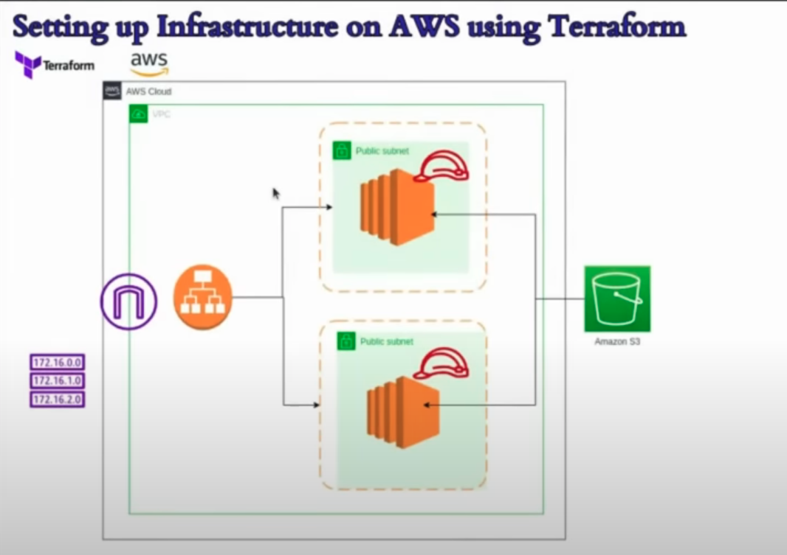

# Terraform AWS Infrastructure Project

## Overview

This project automates the creation of AWS infrastructure using Terraform. The infrastructure includes the following components:

- **VPC (Virtual Private Cloud)**: A custom VPC to host the resources.
- **Public Subnets**: Two public subnets in different availability zones.
- **Internet Gateway**: Allows instances in the VPC to access the internet.
- **Route Table**: Routes traffic from the subnets to the internet gateway.
- **Security Groups**: Firewall rules to control inbound and outbound traffic.
- **EC2 Instances**: Two t2.micro instances deployed in different subnets.
- **Application Load Balancer (ALB)**: Distributes traffic across the EC2 instances.
- **S3 Bucket**: Used for storage with specific access controls.

## Architecture Diagram



## Prerequisites

- **Terraform**: Ensure Terraform is installed on your machine. You can download it from the [official Terraform website](https://www.terraform.io/downloads.html).
- **AWS Account**: You must have an AWS account with IAM credentials configured.

## Terraform Setup

1. **Clone the Repository**:
   ```bash
   git clone https://github.com/Rohansaini1512/Terraform_Project_on_AWS.git
   cd terraform-aws-project

## Terraform Commands

### Initialize Terraform:
To initialize your Terraform configuration, run the following command:

```bash
terraform init

### Validate the configuration:
To validate the configuration files, use the command:

```bash
terraform validate

### Plan the Infrastructure:
To create an execution plan and preview the actions Terraform will take, run:

```bash
terraform plan

### Apply the configuration:
To apply the changes required to reach the desired state of the configuration, use:

```bash
terraform apply

### Clean Up
To destroy all the resources created by this Terraform configuration:

```bash
terraform destroy

